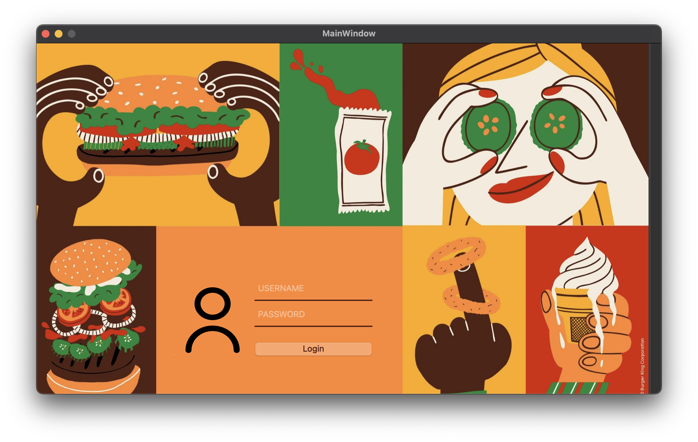
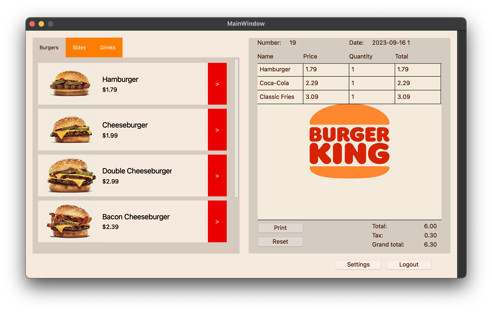
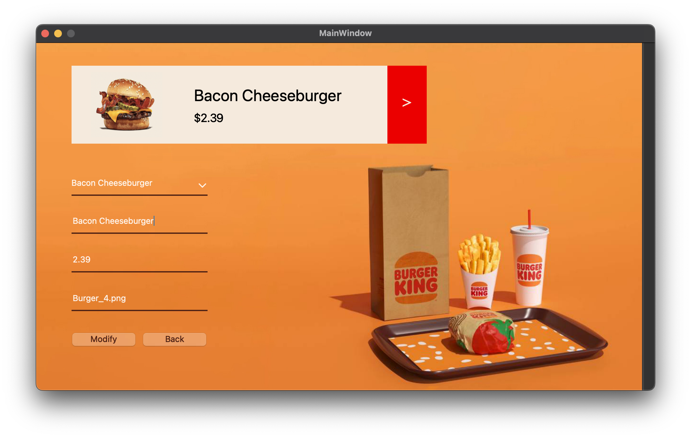

# Drscription
Billing App with PyQt5 & SQLite

## Pages
- Login page includes username and password fields, login button, error message:

- Main page includes products list with add button and billing table that calculate tax, total price and grand total:

- Settings page to update products name, price and image:

